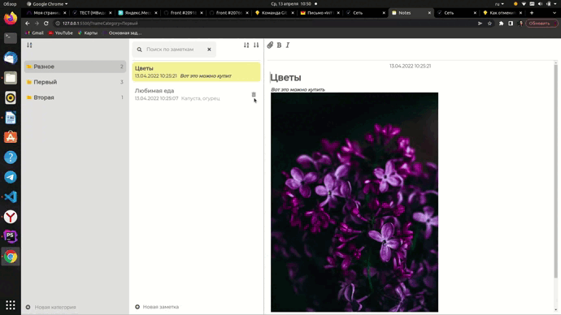
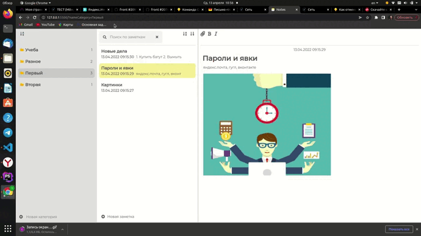
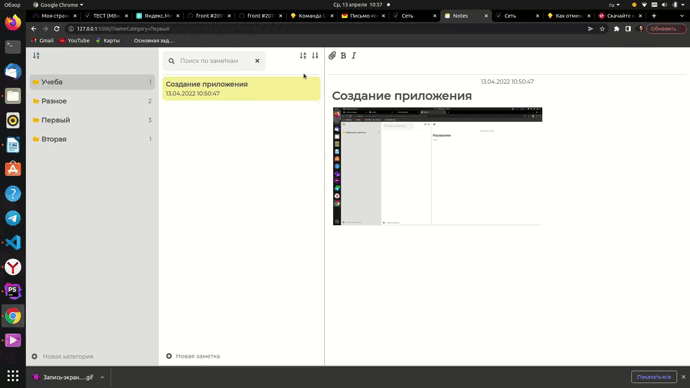

<h1 align="center">NOTES</h1>
<h2 align="center">
</h2>
<p>Notes - приложение для создания заметок.</p>
<p align="center">

</p>

## Описание

Notes - простое приложение для создания и редактирования заметок. Создан на JavaScript, паттерн проектирования - MVS, хранение данных на стороне клиента - IndexedDB.

## Демонстрация работы

### Создание категорий и заметок
<p align="center">
</p>

### Редактирование заметок
<p align="center">
</p>

### Поиск и сортировка
<p align="center">
</p>

## О проекте

### Добавление картинок

Для добавления картинок использовался глобальный объект JavaScript FileReader, который позволяет читать данные из Blob:
```JavaScript
reader.readAsDataURL(file);
```
### Хранение данных о категориях и заметках
Данные хранятся на стороне клиента в базе данных IndexedDB. Компоненты для работы с базой данных лежат в scripts/store.
Модуль store.js отвечает за хранение общего состояния приложения и импортирует IndexedDB.
Модуль indexedDB.js определяет класс IndexedDB с конструктором и возвращает объект после успешного подключения к базе.

## Настройка проекта

```
npm install
npx webpack
```
